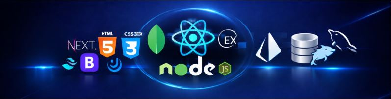

<!-- ===================== BANNER ===================== -->

  

<h1 align="center">Rajesh Ananta Patil</h1>
<h3 align="center">🚀 Full-Stack Developer | MERN | Scalable Backend Systems</h3>

  <a href="https://www.linkedin.com/in/rajesh-patil-22517a210/" target="_blank">LinkedIn</a> •
  <a href="https://github.com/Tejraj0319" target="_blank">GitHub</a> •
  <a href="https://courageous-tartufo-48976b.netlify.app/" target="_blank">Portfolio</a> •
  📧 rajeshpatil222001@gmail.com • 📞 +91 9665492870

# Hi, I'm Rajesh Patil 👋

Backend-Focused Full Stack Developer specializing in scalable MERN applications, secure REST APIs, real-time systems, and workflow automation.

## Tech Stack
- Frontend: React.js, Next.js, Redux Toolkit, Tailwind CSS
- Backend: Node.js, Express.js, Prisma ORM
- Databases: MongoDB, MySQL
- Authentication: JWT, OAuth 2.0, RBAC
- Real-Time: Socket.IO
- Tools: Git, Postman, Cloudinary, Razorpay

## Featured Projects

### EventNest
Full-stack event booking ecosystem with Organizer/Admin/Public dashboards.

Features:
- Razorpay Integration
- QR Ticket Generation
- Booking Engine
- Prisma Transactions
- Cron Automation
- Revenue Analytics

🔗 Live Demo  
🔗 GitHub Repo

---

### QuickChat
Real-time chat application built using MERN + Socket.IO.

Features:
- Typing Indicators
- Real-Time Messaging
- Room Chats
- JWT Authentication

🔗 Live Demo  
🔗 GitHub Repo

---

### ZeeCare
Hospital Management System with RBAC and appointment scheduling.

Features:
- Role-Based Access
- JWT Security
- Appointment Booking
- Cloudinary Uploads

🔗 GitHub Repo
